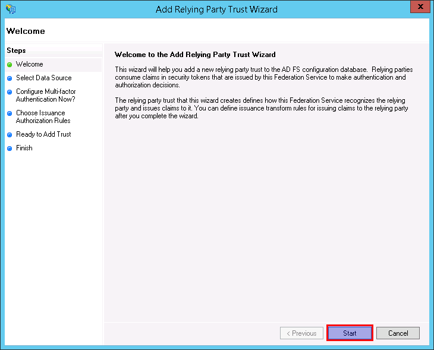
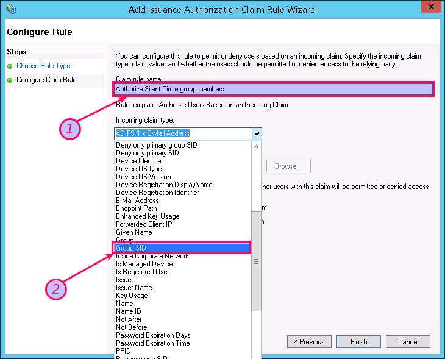

# ADFS Integration for Silent Circle Enterprise Customers

## System Requirements

* Microsoft Windows Server 2012 R2
* Microsoft Active Directory Federation Services 3.0

## Configuration Steps

### Configure Active Directory Federation Services (ADFS)

This is where we add the Silent Circle trust relationship. There are two ways
of doing this:

* [Configure using Windows PowerShell cmdlets](#scups) provided by Silent Circle.
* [Configure using the AD FS GUI tools](#scutg).

The GUI tools show you step-by-step what is happening, while the cmdlet is much
quicker and easier to use for people that have access to, and experience with,
Windows PowerShell.

---

### Configure using PowerShell cmdlets
<a name="scups"></a>

Some PowerShell cmdlets are available for download from Silent Circle's [GitHub
SSO repository](https://github.com/SilentCircle/sso-integration) that can
assist with automating Silent Circle's AD FS integration.

To download, you can clone the GitHub repository as follows:

    git clone https://github.com/SilentCircle/sso-integration.git

You can also download the repository as a ZIP file using
[this link](https://github.com/SilentCircle/sso-integration/archive/master.zip).

From PowerShell, you can download and extract the ZIP file as follows:

```ps1
Invoke-WebRequest -Uri https://github.com/SilentCircle/sso-integration/archive/master.zip -OutFile SilentCircleSSO.zip
Add-Type -assembly "system.io.compression.filesystem"
[io.compression.zipfile]::ExtractToDirectory("SilentCircleSSO.zip", "SilentCircle")
```
The files will be in the SilentCircle directory.

```
PS C:\Users\Administrator> cd .\SilentCircle\sso-integration-master\adfs\3.0\scripts

PS C:\Users\Administrator\SilentCircle\sso-integration-master\adfs\3.0\scripts> dir


    Directory: C:\Users\Administrator\SilentCircle\sso-integration-master\adfs\3.0\scripts


Mode                LastWriteTime     Length Name
----                -------------     ------ ----
-a---         4/28/2016  11:17 AM      10750 Add-SilentCircleRelyingPartyTrust.ps1
-a---         4/28/2016  11:17 AM       3330 Remove-SilentCircleRelyingPartyTrust.ps1
```

---

#### Accessing Help Documentation

The cmdlets have detailed on-line help documentation that can be seen by
running the following commands:

```ps1
Get-Help .\Add-SilentCircleRelyingPartyTrust.ps1 -Full
Get-Help .\Remove-SilentCircleRelyingPartyTrust.ps1 -Full
```

---

### Adding Silent Circle as a Relying Party

First decide if you want to use an Active Directory group to restrict which
users may use Silent Circle, using an Issuance Authorization Rule that the
cmdlet will create for you. If you do decide to go ahead, ensure you know the
group name and that it is visible on your system. For example, let's say the
group is named 'Silent Circle Enterprise User'. Using `Get-ADGroup`, you can
find out if the group is known.

```ps1
> Get-ADGroup -Identity 'Silent Circle Enterprise User'


DistinguishedName : CN=Silent Circle Enterprise User,CN=Users,DC=sso-dev0,DC=silentcircle-inc,DC=org
GroupCategory     : Security
GroupScope        : Global
Name              : Silent Circle Enterprise User
ObjectClass       : group
ObjectGUID        : af259a14-9f85-437e-a9c2-e327b03129fb
SamAccountName    : Silent Circle Enterprise User
SID               : S-1-5-21-207668378-2981979776-1947477811-1112
```

---

In this example, we'll assume you have added the abovenamed group and want to
create an Issuance Authorization Rule. Here's the command and sample output.

```ps1
PS C:\Users\Administrator\Scripts> .\Add-SilentCircleRelyingPartyTrust.ps1 -IssuanceAuthorizationGroupName 'Silent Circle Enterprise User'
PS C:\Users\Administrator\Scripts>
```

**That's all there is to it. You're done.**

All that's left now is to test the integration. If you want to see what was
created, and you don't want to run the cmdlet again, you can do it like this:

---

```ps1
PS C:\Users\Administrator\Scripts> Get-AdfsRelyingPartyTrust -Name 'Silent Circle Enterprise Client'
... output omitted ...

PS C:\Users\Administrator\Scripts> Get-AdfsClient -ClientId SCEntClient
... output omitted ...
```

---

If you run the command a second time, you get warning messages telling you that
the Relying Party trust and OAuth 2.0 client exist, and the cmdlet will not
take any action:

```ps1
PS C:\Users\Administrator\Scripts> .\Add-SilentCircleRelyingPartyTrust.ps1 -IssuanceAuthorizationGroupName 'Silent Circle Enterprise User'
WARNING: Relying Party trust already exists: Silent Circle Enterprise Client; skipping creation.
WARNING: Client ID already exists: SCEntClient; skipping creation.
```

---

If you're not happy with the results, you can tell the command to first clear
out the trust and client before running:

```ps1
PS C:\Users\Administrator\Scripts> .\Add-SilentCircleRelyingPartyTrust.ps1 -IssuanceAuthorizationGroupName 'Silent Circle Enterprise User' -DeleteBeforeCreating
PS C:\Users\Administrator\Scripts>
```

---

Finally, if you want to remove all traces of the integration, you can use the
`Remove-SilentCircleRelyingPartyTrust.ps1` cmdlet:

```ps1
PS C:\Users\Administrator\Scripts> .\Remove-SilentCircleRelyingPartyTrust.ps1
Removed AdfsRelyingPartyTrust -TargetName Silent Circle Enterprise Client
Removed AdfsClient -TargetClientId SCEntClient

```

If you want more detail on what's going on behind the scenes, you can add the
`-Verbose` option, as follows (notice we've used the `-DeleteBeforeCreating`
option too:

```ps1
PS C:\Users\Administrator\Scripts> .\Add-SilentCircleRelyingPartyTrust.ps1 -IssuanceAuthorizationGroupName 'Silent Circle Enterprise User' -Verbose -DeleteBeforeCreating
VERBOSE: Group SID for 'Silent Circle Enterprise User': 'S-1-5-21-207668378-2981979776-1947477811-1112'
VERBOSE: Removed AdfsRelyingPartyTrust -TargetName 'Silent Circle Enterprise Client'
VERBOSE: Added AdfsRelyingPartyTrust -Name Silent Circle Enterprise Client
VERBOSE: Set IssuanceAuthorizationRules 'Silent Circle Enterprise Client':
@RuleTemplate = "Authorization"
@RuleName = "Silent Circle Enterprise User"
c:[Type == "http://schemas.microsoft.com/ws/2008/06/identity/claims/groupsid",
   Value =~ "^(?i)S-1-5-21-207668378-2981979776-1947477811-1112$"]
=> issue(Type = "http://schemas.microsoft.com/authorization/claims/permit",
         Value = "PermitUsersWithClaim");
VERBOSE: Set IssuanceTransformRules 'Silent Circle Enterprise Client':
@RuleName = "Silent Circle Enterprise Client Mapping"
c:[Type == "http://schemas.microsoft.com/ws/2008/06/identity/claims/windowsaccountname",
   Issuer == "AD AUTHORITY"]
=> issue(store = "Active Directory",
         types = ("sub", "email", "name"),
         query = ";objectGUID,userPrincipalName,displayName;{0}",
         param = c.Value);
VERBOSE: Created Relying Party Trust:

AllowedAuthenticationClassReferences : {}
AutoUpdateEnabled                    : False
DelegationAuthorizationRules         :
EncryptionCertificateRevocationCheck : CheckChainExcludeRoot
PublishedThroughProxy                : False
IssuanceAuthorizationRules           : @RuleTemplate = "Authorization"
                                       @RuleName = "Silent Circle Enterprise User"
                                       c:[Type == "http://schemas.microsoft.com/ws/2008/06/identity/claims/groupsid", Value =~ "^(?i)S-1-5-21-207668378-2981979776-1947477811-1112$"]
                                        => issue(Type = "http://schemas.microsoft.com/authorization/claims/permit", Value = "PermitUsersWithClaim");


SigningCertificateRevocationCheck    : CheckChainExcludeRoot
WSFedEndpoint                        :
AdditionalWSFedEndpoint              : {}
ClaimsProviderName                   : {}
IssuanceTransformRules               : @RuleName = "Silent Circle Enterprise Client Mapping"
                                       c:[Type == "http://schemas.microsoft.com/ws/2008/06/identity/claims/windowsaccountname", Issuer == "AD AUTHORITY"]
                                        => issue(store = "Active Directory", types = ("sub", "email", "name"), query = ";objectGUID,userPrincipalName,displayName;{0}", param = c.Value);


ClaimsAccepted                       : {}
ConflictWithPublishedPolicy          : False
EncryptClaims                        : True
Enabled                              : True
EncryptionCertificate                :
Identifier                           : {silentcircle-entapi://rpid}
LastMonitoredTime                    : 1/1/1900 12:00:00 AM
LastPublishedPolicyCheckSuccessful   :
LastUpdateTime                       : 1/1/1900 12:00:00 AM
MetadataUrl                          :
MonitoringEnabled                    : False
Name                                 : Silent Circle Enterprise Client
NotBeforeSkew                        : 0
EnableJWT                            : False
AlwaysRequireAuthentication          : False
Notes                                :
OrganizationInfo                     :
ImpersonationAuthorizationRules      :
AdditionalAuthenticationRules        :
ProxyEndpointMappings                : {}
ProxyTrustedEndpoints                : {}
ProtocolProfile                      : WsFed-SAML
RequestSigningCertificate            : {}
EncryptedNameIdRequired              : False
SignedSamlRequestsRequired           : False
SamlEndpoints                        : {}
SamlResponseSignature                : AssertionOnly
SignatureAlgorithm                   : http://www.w3.org/2001/04/xmldsig-more#rsa-sha256
TokenLifetime                        : 0
AllowedClientTypes                   : Public
IssueOAuthRefreshTokensTo            : AllDevices


VERBOSE: Removed AdfsClient -ClientId 'SCEntClient'
VERBOSE: Created AdfsClient:

RedirectUri : {http://localsc.ch:8000/sso/oauth2/return/, https://accounts.silentcircle.com/sso/oauth2/return/, https://accounts-dev.silentcircle.com/sso/oauth2/return/, https://localsc.ch/sso/oauth2/return/}
Name        : Silent Circle Enterprise Client
Description : Silent Circle Enterprise Client
ClientId    : SCEntClient
BuiltIn     : False
Enabled     : True
ClientType  : Public
```

---

### Configure using the AD FS GUI Tools
<a name="scutg"></a>

#### In Server Manager, select `Tools > AD FS Management`.

---


---

#### Launch the `Add Relying Party Trust` Wizard

---


---
#### Start the `Add Relying Party Trust` Wizard




#### Select `Enter data about the relying party manually`


---

#### Add Silent Circle information

* Enter "Silent Circle Enterprise Client" in `Display name`, and any notes that
  might be of interest.
* Click `Next`.


---

#### Select AD FS Profile


---

#### Skip Token Encryption Certificate


---

#### Skip WS-Federation and SAML


---

#### Add Relying Party trust identifier

* Enter `silentcircle-entapi://rpid` in `Relying party trust identifier` and
  click `Add`


---

* Click `Next` to accept the trust identifier.


---

#### Optional: Configure MFA

* We skip this step here, but you are free to configure MFA as desired.


---

#### Choose Issuance Authorization Rules

* We will restrict access in a later step; for now, permit all users to access
  this Relying Party.


---

#### Add Trust to the database


---

#### Close the wizard

* Click `Close`. This will launch the `Edit Claims Rules Dialog`.


---

### Configure Claims Rules

#### Add Issuance Transform Rule

* The `Edit Claims Rules for Silent Circle Enterprise Client` wizard should be
  running now.
* On the `Issuance Transform Rules` tab, click on `Add Rule...`


---

#### Accept the `Send LDAP Attributes as Claims` template.


---

#### Configure Temp Claim Rule

* Type "Temp" as the claim rule name (we'll be copying this later and deleting
  it).
* Select `Active Directory` as the attribute store.


---

#### Add LDAP attributes

* Add the following LDAP attribute to Outgoing claim type mappings:
  * `objectGUID` to `sub`
  * `User-Principal-Name` to `email`
  * `displayName` to `name` (note that the Wizard keeps changing this to `Name`
    - allow it to do so for now; we'll change it later).


---


---


---


* Click `Finish`.

---

#### Copy Claim Rule Language

* Click `Edit Rule...` and then `View Rule Language`. Copy the selected text
  (right-click, then `Copy`).


---


---


---

* Click `OK`, then `Cancel` to exit the rule editor.


---

#### Add Custom Rule

* `Add rule...` to create a new rule based on `Send Claims Using a Custom Rule`.


---


---

* Name it "Send Silent Circle Enterprise Client Claims` and paste the copied
  text into it.
* Delete the text `http://schemas.xmlsoap.org/ws/2005/05/identity/claims/`.


---

*  What should be left is `name`.


* Click `Finish`.

#### Delete temp rule


* Delete the `Temp` rule.
* Press `OK`.

---

### Add Issuance Authorization Rules

The precise details will vary widely, but you will most likely want to restrict
which employees can use Silent Circle. This can be done using Issuance
Authorization Rules. If an employee tries to authenticate for a Silent Circle
resource (like Silent Phone), but is blocked by this rule, the employee will be
prevented by AD FS from authenticating, and will not be authorized to use
Silent Circle.

In this chapter we add a simple rule based on a user group that was previously
added.

* Select the `Issuance Authorization Rules` tab in `Edit Claim Rules`, and
  click on `Add Rule...`.


---

* Select `Permit or Deny Users Based on an Incoming Claim`.


---

* Type in a rule name like `Authorize Silent Circle group members`.
* Select `Group SID` as an Incoming Claim Type.



---

* Ensuring that the claim type is still `Group SID`, click `Browse` to select
  an incoming claim rule.


---

* In the `Select User, Computer, or Group` dialog box, start typing in the
  group name. In this example, we've typed in `Silent Cir` and deliberately not
  completed it.


---

* Now, click `Check Names` and the name will be auto-completed if possible.
  Otherwise, type in the full group name and click `Check names` again,
  followed by `OK`.


---

* Ensure that all the fields are correct as shown:
    * Incoming claim type: `Group SID`
    * Incoming claim value: (varies by installation)
    * Radio button selected: `Permit access to users with this incoming claim`.
* Click `Finish`.


---

* Remove the default rule, `Permit Access to All Users`.


---

* There should only be one rule left; the one we just added. Click `OK`.


---

* Finally, we see the `Silent Circle Relying Party` Enterprise Trust rule we've
  been working on.


---

### Configure Silent Circle ADFS OAuth2 Client

This is the last step. In this step we need to configure the Silent Circle
OAuth2 client.

In a PowerShell window, type in the following command:

```ps1
Add-AdfsClient -ClientId SCEntClient `
  -Name 'Silent Circle Enterprise Client' `
  -Description 'Silent Circle Enterprise Client' `
  -RedirectURI https://accounts.silentcircle.com/sso/oauth2/return/,https://accounts-dev.silentcircle.com/sso/oauth2/return/,https://localsc.ch/sso/oauth2/return/,http://localsc.ch:8000/sso/oauth2/return/
```

To check it, type in

    Get-AdfsClient 'Silent Circle Enterprise Client'

Sample output is shown below.

```ps1
PS C:\Users\Administrator> Get-AdfsClient 'Silent Circle Enterprise Client'


RedirectUri : {http://localsc.ch:8000/sso/oauth2/return/, https://accounts.silentcircle.com/sso/oauth2/return/,
              https://accounts-dev.silentcircle.com/sso/oauth2/return/, https://localsc.ch/sso/oauth2/return/}
Name        : Silent Circle Enterprise Client
Description : Silent Circle Enterprise Client
ClientId    : SCEntClient
BuiltIn     : False
Enabled     : True
ClientType  : Public
```

<!--

TODO

## Onboarding Process

* Phone call
* Do this on test system
* Do acceptance testing on testem for correct turnup
* Once compelte send us an email saying its provided
* Please provide us with 5 test accounts
* We validate interop on test system
* Turn up on production system - follow same test
* Complete acceptance testing process
* Send us an email saying its complete, we validate
* We declare that its done
* List of domains
* What do they need to provide us?
* What do we need from them?
* They must accept the integration - tc says an email is acceptable.
-->

# Appendixes

## Silent Circle AD FS Issuance Transform Rules
<a name="sscafitr"></a>

* Claim store issuer: Active Directory
* Claim Type: `http://schemas.microsoft.com/ws/2008/06/identity/claims/windowsaccountname`
* Transforms as shown below.

| Active Directory attribute | Silent Circle claim |
| -------------------------- | --------------------|
| objectGUID                 | sub                 |
| userPrincipalName          | email               |
| displayName                | name                |

**AD FS Rule Code**

```ps1
c:[Type == "http://schemas.microsoft.com/ws/2008/06/identity/claims/windowsaccountname",
   Issuer == "AD AUTHORITY"]
   => issue(store = "Active Directory",
      types = ("sub", "email", "name"),
      query = ";objectGUID,userPrincipalName,displayName;{0}",
      param = c.Value);
```

## Silent Circle AD FS Issuance Authorization Rules (Example only)
<a name="sscafiar"></a>

You will probably want to restrict which of your users are allowed to use
Silent Circle. Your AD FS configuration will need Issuance Authorization Rules
that only allow a subset of users to be authorized. When an unauthorized user
tries to sign on to your AD FS site, the sign-on attempt will be rejected by
your site (not by Silent Circle).

Rules will differ widely depending on your organizational policies, so it is
not possible to provide more than a sample rule set. The following rule allows
only users that belong to a group with Group Security ID
`S-1-5-21-207668378-2981979776-1947477811-1112`:

**AD FS Rule Code**

```
c:[Type == "http://schemas.microsoft.com/ws/2008/06/identity/claims/groupsid",
   Value =~ "^(?i)S-1-5-21-207668378-2981979776-1947477811-1112$"]
 => issue(Type = "http://schemas.microsoft.com/authorization/claims/permit",
          Value = "PermitUsersWithClaim");
```

