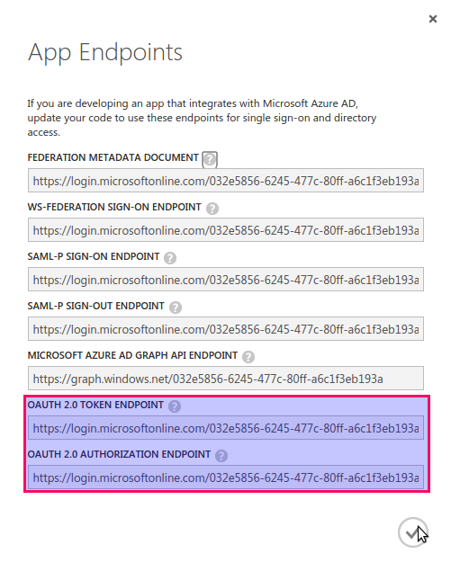

# How to register an app for OAuth 2.0/OpenID Connect on MS Azure

## Introduction

Microsoft has two sets of OAuth 2.0/OpenID Connect endpoints. The
newer one, [Azure Active Directory V2][MS.Azure.AD.ADv2Compare],
is known as the `v2.0 endpoint`. The older one will be referred to
in this document as the "classic" endpoint, for want of a better
term.

Because the v2.0 endpoint has some limitations that impact us, this
document presents the classic endpoint first.

### The v2.0 endpoint

Microsoft has this to say about the `V2.0 endpoint`:

> In the past, an app developer who wanted to support both Microsoft
accounts and Azure Active Directory was required to integrate with
two separate systems. We've now introduced a new authentication API
version that enables you to sign in users in with both types of
accounts using the Azure AD system. This converged authentication
system is known as the v2.0 endpoint. With the v2.0 endpoint, one
simple integration allows you to reach an audience that spans
millions of users with both personal and work/school accounts.
>
> Apps that use the v2.0 endpoint can also consume REST APIs from the
Microsoft Graph and Office 365 using either type of account.

### v2.0 Redirect URI Limitations 

This endpoint some benefits but also has some significant
limitations, such as the ability to support multiple redirect URIs
per application only if the URIs all have the same base URI.

For example, these URIs are accepted in combination:

* `https://accounts.silentcircle.com/sso/oauth2/return/`
* `https://dev.accounts.silentcircle.com/sso/oauth2/return/`

But these two will not be accepted at the same time:

* `https://accounts.silentcircle.com/sso/oauth2/return/`
* `https://accounts-dev.silentcircle.com/sso/oauth2/return/`

## Registering for the "Classic" endpoint

### Sign on to Azure Management Portal

* Navigate to the [Azure Management Portal][MS.Azure.Manage] and
  sign in as a Global Administrator.

### Select Active Directory

* Click on the "Active Directory" icon.

* Click on the directory that will be associated with the
  application.

---

### Open Applications page

* Click on Applications in the menu bar that appears.

---

### Add application

* Click on "Add" at the bottom of the page.

---

* Select "Add an application my organization is developing"

---

### Tell us about your application

1. Set the name to SCEntClient
2. Choose "WEB APPLICATION AND/OR WEB API"
3. Click the "Next" arrow icon.

---

### Add App Properties

1. Set Sign-on URL to "https://accounts.silentcircle.com/".
2. Set App ID URI to "https://silentcircle.com/azure/scentclient/".
3. Click the "Accept" (checkmark) icon.

---

### Your app has been added!

* Under "GET STARTED", click on "ENABLE YOUR USERS TO SIGN IN".

---

### Get Started

* Copy the App ID URI.

---

### Configure

* Under "CONFIGURE", click "ACCESS WEB APIS IN OTHER APPLICATIONS".

1. Copy the contents of "UPDATE YOUR CODE WITH YOUR CLIENT ID". This
   is the OAuth2/OpenID Connect `client_id`.
2. Where it shows "Your application needs a key to access web APIs
   in another application secured by Microsoft Azure AD", click on
   the link "Configure key".

### Configure Key

Under the "keys" heading, click on the "Select duration" drop-down
list box. Choose a duration (2 Years is suggested). The form shows a
message "THE KEY VALUE WILL BE DISPLAYED AFTER YOU SAVE IT."

---

Once the duration is selected, the drop-down list box is replaced by
the selected duration.

---

Click on the Save icon at the bottom of the page.

### Copy key value

You are warned "Copy and store the key value. You won't be able to
retrieve it after you leave this page."

Copy the now-visible key value, which will be used as the OpenID
Connect/OAuth 2 `client_key`.

---

### Add Redirect URIs

Add the following reply URLs (redirect URIs). You can replace the one that is already there.

* https://accounts.silentcircle.com/sso/oauth2/return/
* https://accounts-dev.silentcircle.com/sso/oauth2/return/
* https://localsc.ch/sso/oauth2/return/
* http://localsc.ch:8000/sso/oauth2/return/

---

Click on the Save icon at the bottom of the page.

### View Endpoints

To see the various endpoints associated with this application, click
the "View Endpoints" icon at the bottom of the page.  You may want
to copy the OAuth2 token endpoint and the OAuth2 authorization
endpoint.

---

**NOTE**: The URL for the OpenID Connect Discovery Document will be
"https://login.microsoftonline.com/{tenant-id}/.well-known/openid-configuration/",
where the tenant id is the UUID from the authorization endpoint.

---

## Registering for the V2.0 endpoint

This assumes that you have a Microsoft Live or your Silent Circle
account.

**NOTE**

The application ID and password shown is for an application that was
created on a test account and has been deleted, so there are no
security concerns with these credentials.

### Sign on

* Navigate to [Microsoft App Dev site][MS.Apps.Dev].
* Sign in to the Application Registration Portal using your MS
  credentials.

### Add application

* Click "Add an App" to create a new application.

* Enter SCEntClient and press "Create application"

* You will be presented with the application form as shown here.
  Make a note of the application id after it is created.

---

## Generate password

* Under Application Secrets, click "Generate New Password" and make
  a note of it.

---

## Add platform

* Under Platforms, click "Add Platform" and choose "Web".

* Deselect "Allow Implicit Flow".

---

## Add Redirect URI

* Add a redirect URI: `https://accounts.silentcircle.com/sso/oauth2/return/`
* To add more redirect URIs, click the "Add URL" button.

---

**NOTE**: See [v2.0 Redirect URI limitations](#v2endpointlimitations).

## Optional steps

* (Optional) Add profile information, such as company logo and
  privacy policy URLs, to the `Profile` section.
* (Optional) Tick "Live SDK Support".

## Save application

* Click "Save". If you get the error shown below, remove all but one
  Redirect URI and try again.

<!-- Links -->

[MS.Apps.Dev]: https://apps.dev.microsoft.com/
[MS.Azure.AD.ADv2Compare]: https://azure.microsoft.com/en-us/documentation/articles/active-directory-v2-compare/
[MS.Azure.Manage]: https://manage.windowsazure.com/

<link href="styles/sc-metro-vibes-light.css" rel="stylesheet">

<!--- vim: set textwidth=68 formatoptions+=t et : -->
