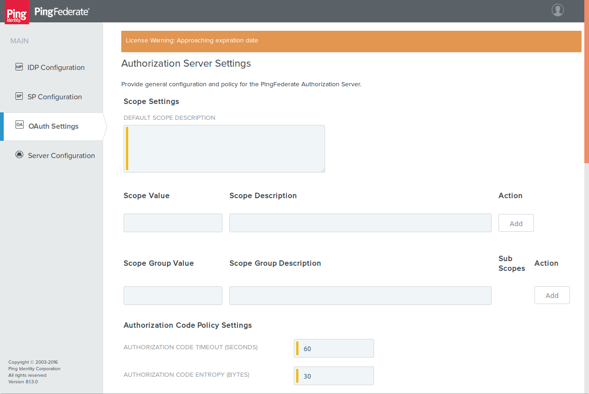
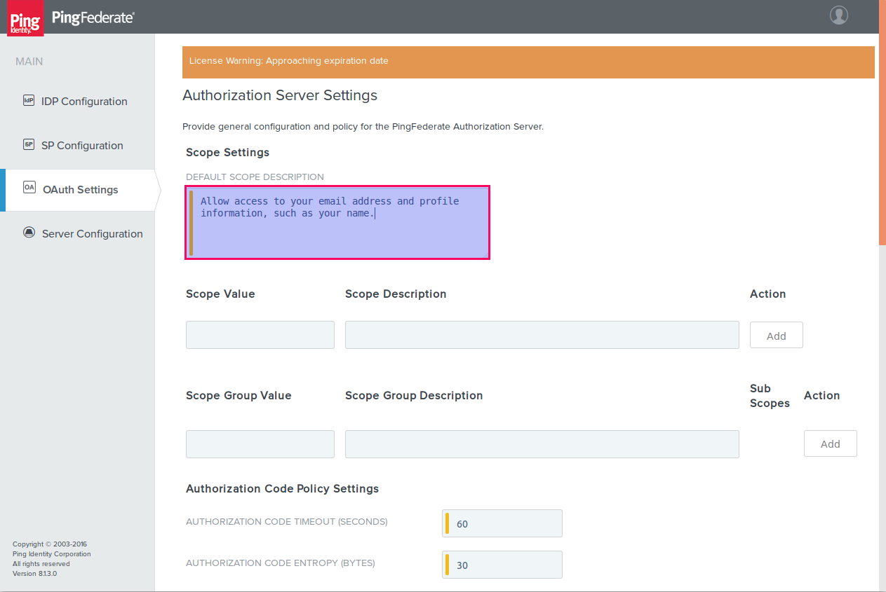
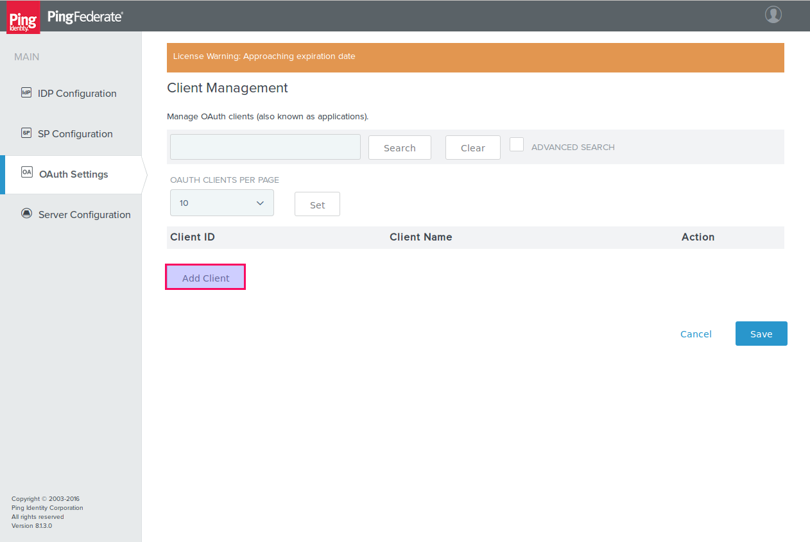
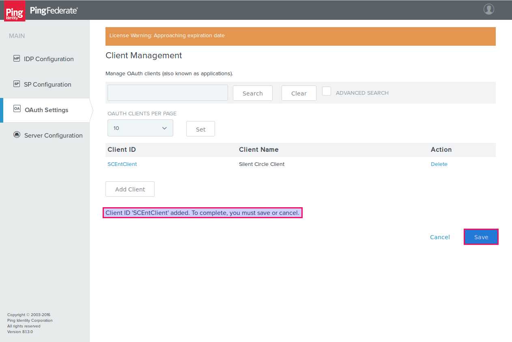
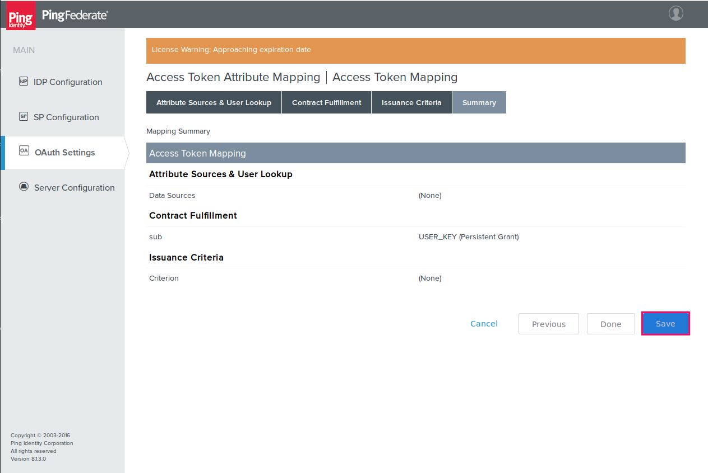
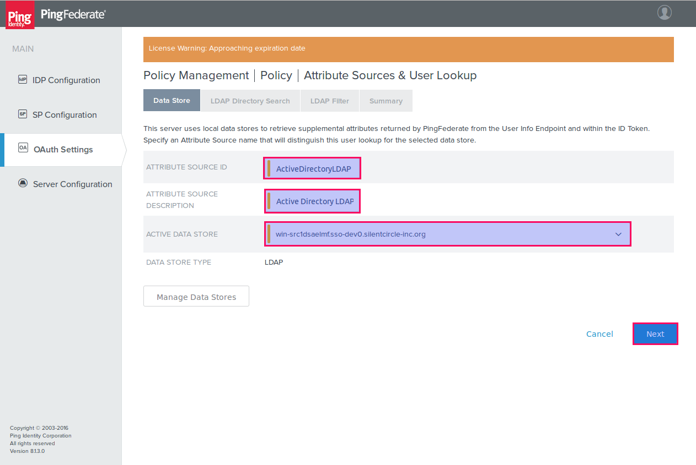

<!-- START TOC -->
-   [PingFederate Integration](#pingfederate-integration)
-   [PingFederate OpenID Connect configuration for Silent Circle](#pingfederate-openid-connect-configuration-for-silent-circle)
    -   [Requirements](#requirements)
    -   [Overview](#overview)
        -   [Integration Automation](#integration-automation)
    -   [Sign on to PingFederate as an administrator](#sign-on-to-pingfederate-as-an-administrator)
    -   [Enable the OAuth Authorization Server](#enable-the-oauth-authorization-server)
        -   [Change System Settings](#change-system-settings)
        -   [Change Roles and Protocols](#change-roles-and-protocols)
    -   [Create a Credential Validator](#create-a-credential-validator)
        -   [Identify Password Credential Validator instance](#identify-password-credential-validator-instance)
        -   [Specify LDAP Datastore](#specify-ldap-datastore)
        -   [Sidebar: The search filter](#sidebar-the-search-filter)
    -   [Configure Authorization Server settings](#configure-authorization-server-settings)
    -   [Create the Silent Circle OAuth Client](#create-the-silent-circle-oauth-client)
    -   [Define OAuth Access Token Management policies](#define-oauth-access-token-management-policies)
    -   [Create an Identity Provider (IdP) Adapter instance](#create-an-identity-provider-idp-adapter-instance)
    -   [Create IdP Adapter mappings](#create-idp-adapter-mappings)
    -   [Create Access Token mapping](#create-access-token-mapping)
    -   [Define OpenID Connect Policy](#define-openid-connect-policy)
-   [Customer Integration Overview](#customer-integration-overview)
    -   [Introduction](#introduction)
        -   [Phase 1: Pre-Production](#phase-1-pre-production)
        -   [Phase 2: Production](#phase-2-production)
    -   [Integration](#integration)
-   [Acceptance Test Procedure](#acceptance-test-procedure)
    -   [SP1: Provision Silent Phone using SSO](#sp1-provision-silent-phone-using-sso)
    -   [SP2: Silent Phone SSO (unauthorized user - OPTIONAL)](#sp2-silent-phone-sso-unauthorized-user---optional)
    -   [SP3: Silent Phone SSO (invalid user)](#sp3-silent-phone-sso-invalid-user)
    -   [SP4: Silent Phone SSO sanity test](#sp4-silent-phone-sso-sanity-test)
    -   [SW1: Sign On to Silent Circle Web using SSO](#sw1-sign-on-to-silent-circle-web-using-sso)
    -   [SW2: Sign On to Silent Circle Web using SSO (unauthorized user - OPTIONAL)](#sw2-sign-on-to-silent-circle-web-using-sso-unauthorized-user---optional)
    -   [SW3: Sign On to Silent Circle Web using SSO (invalid user)](#sw3-sign-on-to-silent-circle-web-using-sso-invalid-user)
    -   [SW4: Sign out of Silent Circle Web](#sw4-sign-out-of-silent-circle-web)
    -   [Validation](#validation)
-   [Appendix A: Notes](#appendix-a-notes)
    -   [A.1: OpenID Connect Discovery Document](#a.1-openid-connect-discovery-document)
<!-- END TOC -->
# PingFederate Integration

This document comprises the following major sections:

* PingFederate OpenID Connect configuration for Silent Circle
* Customer Integration Overview
* Acceptance Test Procedure
* Appendix A: Notes

---

# PingFederate OpenID Connect configuration for Silent Circle 

## Requirements

* PingFederate Server; v8.1.3 preferred, but v8.1.2 acceptable.
* You have Administrator access to the PingFederate administrative
  console.
* You have a supported identity data source (for example, Active
  Directory) that is usable by PingFederate. This document assumes
  Active Directory is being used. If this is not the case, modify
  the procedure accordingly.

## Overview

PingFederate is a highly configurable application. This document
does not attempt to describe all possible configurations, because
that would not be feasible. Instead, we describe one complete
working configuration that we have tested, and assume that you are
able to substitute the configuration you would need, should our
documented configuration not be entirely suitable.

Note that in this document, reference is made to OAuth as well as
OpenID Connect. This is because OpenID Connect is a superset of
OAuth 2, so the underlying OAuth 2 capabilities also need to be
configured.

The steps required to enable OpenID Connect integration and create a
Silent Circle OpenID Connect client are:

1. Enable the OAuth Authorization Server
2. Create a Credential Validator
3. Configure Authorization Server settings
4. Define OAuth Access Token Management policies
5. Create an Identity Provider (IdP) Adapter instance
6. Create IdP Adapter mappings
7. Create Access Token mapping
8. Define OpenID Connect Policy
9. Create the Silent Circle OAuth client

### Integration Automation

There is currently no Silent Circle automation to perform OpenID
Connect integration. This will be considered for a future release.

---

## Sign on to PingFederate as an administrator

* Navigate to your PingFederate Login Page, for example,
  `https://example.com:9999/pingfederate/app`, and sign on as an
  Administrator.

---

You will now be taken to the PingFederate administrator console's
main page.

---

## Enable the OAuth Authorization Server

### Change System Settings

* Click on `Server Configuration` and then, under `SYSTEM SETTINGS`,
  click on `Server Settings`.

---

### Change Roles and Protocols

* On the Server Configuration Page, click on `Roles & Protocols`.

---

* Check `Enable OAuth 2.0 Authorization Server (AS) Role`.
* Check `OpenID Connect`.

* Check `Enable Identity Provider (IdP) Role and support the following`.
* Check `SAML 2.0`

* Check `Enable Service Provider (SP) Role and Support the Following`.
* Check `SAML 2.0`

---

* Save the Server Configuration.

---

## Create a Credential Validator

This is needed for users to authenticate with the appropriate
credentials. These instructions assume that the authentication is to
be done using Active Directory LDAP. If this is not the case, create
the appropriate validator instead.

* From the main page, go to Server Configuration / Password
  Credential Validators
* Click `Create New Instance`.

---

### Identify Password Credential Validator instance

* Set `Instance Name` to "Active Directory PCV".
* Set `Instance ID` to "ActiveDirectoryPCV" (for example).
* For `Type`, choose `LDAP Username Password Credential Validator`.
* Click `Next`.

---

### Specify LDAP Datastore

* Select the appropriate LDAP datastore.
* Set `Search Base`, for example `dc=sso-dev0,dc=silentcircle-inc,dc=org`.
* Set the `Search Filter` to
  `(&(mail=${username})(sAMAccountType=805306368)(!(userAccountControl:1.2.840.113556.1.4.803:=2)))`.
* Click `Next`.

* **NOTE**: We have used the LDAP `mail` attribute to look up the
  user. This is because it is assumed that the user will be
  authenticating using an email address as a user ID, and not
  `userPrincipalName`.  If this is not the case, replace `mail` with
  `userPrincipalName` or some other LDAP attribute name.

---

### Sidebar: The search filter

The search filter is composed as follows:

* `mail=${username}`: Select this user by email address.
* `sAMAccountType=805306368`: This is a user account.
* `!(userAccountControl:1.2.840.113556.1.4.803:=2)`: User account has not been deactivated.

---

* Click `Next` on the `Extended Contract` page.

---

* Click `Done` on the `Summary` page.

---

* Click `Save` on the next page.

---

## Configure Authorization Server settings

* From the main page, go to `OAuth Settings` and click
  `Authorization Server Settings`.

---

* You'll be taken to the `Authorization Server Settings` page.

---

* Add a default scope description. We suggest entering something
  like "Allow access to your email address and profile information,
  such as your name". This will be presented to the user on the
  confirmation page after they sign on.

---

* On the same page, add the email scope value and description:

| Scope Value | Scope Description |
| ----------- | ----------------- |
|  email      | Allow access to email address |

 

---

* Now add the rest to match the entries in the table below.

| Scope Value | Scope Description |
| ----------- | ----------------- |
|  email      | Allow access to email address |
|  openid     | OpenID Connect login |
|  profile    | Allow access to profile information |

 

---

* Scroll down the page and make sure the persistent grant lifetime is blank. We want it to be indefinite.
* Set other values as required.

---

* Scroll down to the bottom of the page.

---

* In the `Password Credential Validator` list box, select `Active Directory PCV`
* Click `Save`.

---

## Create the Silent Circle OAuth Client

* From the main page, go to `OAuth Settings` and click `Client Management`.

---

* On the `Client Management` page, click `Add Client`.

---

* Set `Client ID` to `SCEntClient`.
* Click the `Client Secret` radio button.
* Click the `Generate Secret` button (make sure the `Change Secret`
  checkbox is ticked).
* **IMPORTANT**: Ensure that you copy the secret from the text box
  and save it somewhere. It will be obscured with `****` once you
  navigate away from that page.

---

* Scroll down the page.
* Set `Name` to `Silent Circle Client`.
* Set `Description` to `Silent Circle OpenID Connect Enterprise Client`.

* Add the following redirection URIs:
    * `https://accounts.silentcircle.com/sso/oauth2/return/`
    * `https://accounts-dev.silentcircle.com/sso/oauth2/return/`
    * `https://localsc.ch/sso/oauth2/return/`
    * `http://localsc.ch:8000/sso/oauth2/return/`

* Set `Allowed Grant Types` to `Authorization Code` and `Refresh Token`.

---

* Set the `Persistent Grants Expiration` radio button to `Grants Do Not Expire`.
* Set `Refresh Token Rolling Policy` to `Don't Roll`.
* Select `RSA using SHA-256` in the `ID Token Signing Algorithm`
  drop-down listbox.
* Check `Grant Access to Session Revocation API`.
* Click `Done`.

---

* You have now completed adding the Silent Circle client so click `Save`.

---

## Define OAuth Access Token Management policies

* From the main page, go to OAuth Settings / Access Token Management.

---

* Click `Create New Instance`.

---

* You will be taken to the `Create Access Token Management Instance` page.

---

* Set `Instance Name` to `SCEntClient`.
* Set `Instance ID` to `SCEntClient`.
* Set `Type` to `Internally Managed Reference Tokens`.
* Click `Next`.

---

* The settings on this page depend greatly on your system configuration and security requirements.
    * For example, the longer the token, the more secure it is, so you could increase the token length to (say) 64.
    * The token lifetime is a balance between load on your AS, and how long an access token stays alive after it has been revoked. This value is often set to 8 hours (480 minutes) to reduce the number of times a token needs to be revalidated per day.
    * The token lifetime can be extended through the `Lifetime Extension Policy` if it is a transient token.
    * If you have a database server or LDAP server for long-term data storage, you could also allow [persistent grants](https://documentation.pingidentity.com/pingfederate/pf81/index.html#adminGuide/concept/persistentVsTransientGrants.html).
* Leave the default values, or change them to suit your needs, then click `Next`.

---

* Enter `sub` into the text box, then click `Add`.

**NOTES**

* This is a critical part of the configuration, because the name
  entered here (`sub`, in this case) will be referenced in the
  following places:
    * The LDAP search filter defined in [OpenID Connect Policy Management / Policy / Attribute Sources & User Lookup](#pmpasaullf), for example, `(&(mail=${sub})(...))`.
    * When mapping `Source` to `Value` in [Access Token Attribute Mapping / Access Token Mapping / Contract Fulfillment](#atamatmcf), the `Contract` name will be the name entered here i.e. `sub`).

---

* Click `Next`.

---

* Enter `silentcircle-entapi://rpid` into the `Resource URI` text box, then click `Add`.

---

* Click `Next`.

---

* On the `Access Control` page, check the `Restrict Allowed Clients` checkbox.

---

* Select `SCEntClient` from the `Allowed Clients` drop-down list box, and click `Add`.

---

* Click `Next`.

---

 * On the `Summary` page, check the settings, and click `Save`.

---

## Create an Identity Provider (IdP) Adapter instance

* From the main page, go to the IdP Configuration / Adapters page.

---

* Click `Create New Instance`.

---

* Set `Instance Name` to `HTMLFormAD`.
* Set `Instance ID` to `HTMLFormAD01`.
* In the `Type` drop-down list box, select `HTML Form IdP Adapter`.
* Click `Next`.

---

* Under `Password Credential Validator Instance`, click `Add a new row to 'Credential Validators'`.

---

* From the drop-down list box, select `Active Directory PCV`, which you created earlier, then click `Update`.

---

* The page should now look something like this.

---

* It can be useful to allow users to edit their username when they
  are validating, so optionally check the `Allow username edits during chaining` checkbox.
* Click `Next`.

---

* Leave the `Extended Contract` page unchanged.
* Click `Next`.

---

* On the `Adapter Attributes` page, check the `Pseudonym` checkbox next to `username`.

---

* Click `Next`.

---

* On the `Adapter Contract Mapping` page, click `Next`.

---

* Confirm the settings in the `Summary` page.

---

---

* Click `Done`.

---

* The `Manage IdP Adapter Instances` page should look something like this.
* Click `Save`.

---

## Create IdP Adapter mappings

* From the main page, go to the OAuth Settings / IdP Adapter Mapping
  page.

---

* Click the `Source Adapter Instance` drop-down list box.

---

* Select `HTMLFormAD` and click `Add Mapping`.

---

* On the `Attribute Sources & User Lookup` page, click `Next`.

---

* On the `Contract Fulfillment` page, set the `Source` to `Adapter`
  and the `Value` to `username` for both `USER_KEY` and `USER_NAME`
  contracts.
* Click `Next`.

---

* On the `Issuance Criteria` page, click `Next`.

---

* On the `Summary` page, click `Save`.

---

## Create Access Token mapping

* From the main page, select `OAuth Settings` / `Access Token Mapping`

---

* Click on the `Context` drop-down list box.

---

* Select `IdP Adapter: HTMLFormAD`.
* In the `Access Token Manager` drop-down list box, select
  `SCEntClient`.
* Click `Add Mapping`.

---

* On the `Attribute Sources & User Lookup` page, click `Next`.

---

* On the `Contract Fulfillment` page, select `Persistent Grant` in
  the `Source` drop-down list box corresponding to the `sub`
  contract.
* Select `USER_KEY` in the `Value` drop-down list box.
* Click `Next`.

---

* On the `Issuance Criteria` page, click `Next`.

---

* On the `Summary` page, click `Save`.

---

## Define OpenID Connect Policy

* From the main page, select OAuth Settings / OpenID Connect Policy
  Management.

---

* Click `Add Policy`.

---

* On the `Manage Policy` page, set `Policy ID` to `SCOIDCPolicy`.
* Set `Name` to `Silent Circle OpenID Connect Policy`.
* Select `SCEntClient` from the `Access Token Manager` drop-down list
  box.
* Check the `Include Session Identifier In ID Token` checkbox.
* Check the `Include User Info In ID Token` checkbox.
* Click `Next`.

---

* On the `Attribute Contract` page, you define which claims will be
  returned from the UserInfo endpoint (and possibly in the ID
  Token). The list is pre-populated with all the OpenID Connect
  standard claims. We will delete some of these because they are not
  currently needed by Silent Circle.

---

---

* On the `Attribute Contract` page, we suggest you delete all
  extended claims except the following:

    * `email`
    * `email_verified`
    * `family_name`
    * `given_name`
    * `middle_name`
    * `name`
    * `nickname`
    * `phone_number`
    * `phone_number_verified`
    * `picture`
    * `preferred_username`
    * `profile`

* This is just a suggested list. The bare minimum that Silent Circle
  requires is as follows (in addition to `sub`, of course):

    * `email`
    * `name`

* Click `Next`.

---

* On the `Attribute Sources & User Lookup` page,
  click `Add Attribute Source`.

---

* On the `Data Store` page, set `Attribute Source ID` to `ActiveDirectoryLDAP`.
* Set `Attribute Source Description` to `Active Directory LDAP`.
* Select your LDAP data store from the `Active Data Store` drop-down list box.
* Click `Next`.

---

* On the `LDAP Directory Search` page,set `Base DN` to the base DN
  of your LDAP or Active Directory server. In this example, we have
  used `dc=sso-dev,dc=silentcircle-inc,dc=org`.
* Leave the `Search Scope` at `Subtree`,
* (Optional) Click on the `View Claims Contract` link at the bottom
  of the page. This will pop up a new window in your browser that
  contains a list of all claims that are needed. This will be
  helpful to ensure you map all required claims to LDAP or other
  values.
* Take note of the `Root Object Class` drop-down list box. We will
  be using this in the next step to select LDAP object classes.

---

* In the `Root Object Class` drop-down list box, choose `<Show All Attributes>`.
* This will populate the `Subject DN` drop-down list
  box with all attributes offered by your LDAP or Active Directory
  server, which makes it easier to search for attribute names. If
  you happen to know all the object classes to which the desired
  attributes belong, feel free to select them individually.

---

* From the `Attribute` drop-down list box, choose `givenName` and
  click `Add Attribute`.

---

* In the same way, add the rest of the attributes needed for the claims mapping. The complete list of attributes is:

    * `displayName` (mandatory)
    * `displayNamePrintable`
    * `givenName`
    * `mail` (mandatory)
    * `middleName`
    * `photo`
    * `profilePath`
    * `sn`
    * `telephoneNumber`
    * `userPrincipalName` (mandatory)

* Click `Next`.

**NOTES**

* The attributes marked as `mandatory` comprise the minimum set of
  attributes that Silent Circle currently requires, and correspond
  to the OpenID Connect claims as shown in the table. If you only
  want to support this set of claims, ensure that these are the only
  claims shown on the `Attribute Contract` page we modified earlier.

| OpenID Connect Claim | Active Directory attribute |
| -------------------- | -------------------------- |
| `email`              | `mail`                     |
| `name`               | `displayName`              |
| `sub`                | `userPrincipalName`        |

* It is not an error to get more LDAP attributes than are required,
  as long as they include the attributes to be mapped to the claims.

---

* On the `LDAP Filter` page, set the `Filter` text box to
  `(&(mail=${sub})(sAMAccountType=805306368)(!(userAccountControl:1.2.840.113556.1.4.803:=2)))`.
* Click `Next`.

**NOTES**

* We have used the LDAP `mail` attribute to look up the user. This
  is because it is assumed that the user will be authenticating
  using an email address as a user ID, and not `userPrincipalName`.
  If this is not the case, replace `mail` with `userPrincipalName`.
* Ensure that the `Values` section of the page includes `${sub}`. If
  it does not, something went wrong in the
  [Access Token Management / Access Token Attribute Contract](#atmatac)
  part of the configuration.

---

* Check the summary for correctness.

---

* Click `Done`.

---

* Back on the `Attribute Sources & User Lookup` page, click `Next`.

---

* On the `Contract Fulfillment` page, we will map OpenID Connect
  attributes (claims) to values provided by various sources.
* Locate the `email` `Attribute Contract`.
* Select `LDAP (Active Directory LDAP)` in the corresponding
  `Source` drop-down list box, and `mail` in the `Value` drop-down
  list box.

---

* In a similar fashion, map the rest of the attributes so that the
  page matches the table below.

| Attribute Contract      | Source                         | Value                     |
| ----------------------- | ------------------------------ | ------------------------- |
| `email`                 | `LDAP (Active Directory LDAP)` | `mail`                    |
| `email_verified`        | `Text`                         | `true`                    |
| `family_name`           | `LDAP (Active Directory LDAP)` | `sn`                      |
| `given_name`            | `LDAP (Active Directory LDAP)` | `givenName`               |
| `middle_name`           | `LDAP (Active Directory LDAP)` | `middleName`              |
| `name`                  | `LDAP (Active Directory LDAP)` | `displayName`             |
| `nickname`              | `LDAP (Active Directory LDAP)` | `displayNamePrintable`    |
| `phone_number`          | `LDAP (Active Directory LDAP)` | `telephoneNumber`         |
| `phone_number_verified` | `Text`                         | `true`                    |
| `picture`               | `LDAP (Active Directory LDAP)` | `photo`                   |
| `preferred_username`    | `LDAP (Active Directory LDAP)` | `userPrincipalName`       |
| `profile`               | `LDAP (Active Directory LDAP)` | `profilePath`             |
| `sub`                   | `LDAP (Active Directory LDAP)` | `userPrincipalName`       |

 

---

* Click `Next`.

---

* On the `Issuance Criteria` page, click `Next`.

---

* Check the `Summary` page for correctness.

---

---

---

* Click `Done`.

---

* Back on the `Policy Management` page, click `Save`.

---

* You may get an error message `A default policy is required`. If
  you do, click `Set as Default` in the `Silent Circle OpenID Connect`
  policy table row, and click `Save`.

---

# Customer Integration Overview 

## Introduction

This is an overview of what you can expect to happen during the
onboarding process.

The outline of the process is as follows.

### Phase 1: Pre-Production

* Integration (Phase 1): Silent Circle and your team integrate with
  our SSO test environments.

* Acceptance testing (Phase 1): You test the integration, and once
  satisfied, send an email to the appropriate Silent Circle account
  manager indicating your acceptance of the Phase 1 integration.

* Validation: Silent Circle validates the test integration. To do
  this, we would need some accounts on your test environment.

### Phase 2: Production

* Integration (Phase 2): Silent Circle and your team integrate with
  our SSO production environments.

* Acceptance testing (Phase 2): You test the integration, and once
  satisfied, send an email to the appropriate Silent Circle account
  manager indicating your acceptance of the Phase 2 (production)
  integration.

* Validation: Silent Circle validates the production integration. To
  do this, we would need some accounts on your production
  environment, which you can disable once validation is complete.

## Integration

Silent Circle's SSO integration experts and your federated identity
management experts get together on a conference call.

We have found it to be very advantageous to have a screen sharing
session so that we can offer assistance if issues arise during the
configuration process.

* Agenda
    * Introductions
    * Establish that we understand the requirements correctly
    * Exchange information needed for the integration.
    * Add Silent Circle as a trusted relying party to your federated
      identity system.
    * Do initial sanity testing.

* Participants
    * Silent Circle account manager
    * Silent Circle SSO integration team lead
    * Your SSO expert
    * Anyone else who is needed

* Information we need from you
    * This varies depending on the integration being performed. It
      may include information such as:
      - AD FS host's fully-qualified domain name
      - Federation metadata/OpenID Connect Discovery Document endpoint
      - Federation authorization and token endpoints
    * List of domain names with which your users will sign on
    * Credentials for 5 (five) test users with which we can sign on
      via your SSO test environment

Once the call is over, and assuming there were no blocking issues,
Silent Circle and your federated identity management system should
be integrated and we can move on to testing.

# Acceptance Test Procedure

At this stage, the integration configuration should have been
completed, and now we need to test it.

* Test series SP must be run once for each supported Silent Phone
  device.
* Test series SW should be run at least once with a supported web
  browser.

---

### SP1: Provision Silent Phone using SSO

#### Test equipment

* Test device: A supported smartphone.
* Network connection: WiFi with unrestricted inbound and outbound
  firewall.

#### Preconditions

* Test user has valid credentials and an active account on your
  federated identity system.
* Test user's account belongs to a group in your environment that is
  authorized to use Silent Circle.

#### Procedure

* Ensure that the test device has no Silent Phone installed. If it
  does, uninstall it.
* Download and install Silent Phone from the appropriate app store.
* Launch Silent Phone and accept notifications, if prompted.
* You should see a login form on the device.
* Attempt to sign on the test user. The user id will be in the form
  `user@example.com`.
* You should be taken to your company's SSO sign-on page.
* Enter the user's credentials and send the form.
* Depending on your policies, you may be required to engage in a
  multi-factor authentication process or other activities that are
  part of the regular single sign-on process. It is assumed that you
  are able to complete these successfully.
* After a brief pause while the app provisions with Silent Circle,
  you should be presented with the app's main page.
* Ensure that you can interact with the app by changing to the
  message view, the call view, looking at the settings, and so on.
* Ensure that the user's name and email address are displayed
  correctly.

#### Acceptance criteria

* User is presented with your single sign-on page.
* User's credentials are accepted by your SSO environment.
* Silent Phone app is provisioned and user is able to interact with
  it.
* User's name and email address are displayed correctly.

---

### SP2: Silent Phone SSO (unauthorized user - OPTIONAL)

The purpose of this optional test is to ensure that your federation
group policy (should you have one), authorizing Silent Circle access
only to users who comply with that policy, rejects users that should
not be authorized.

#### Test equipment

* Test device: A supported smartphone.
* Network connection: WiFi with unrestricted inbound and outbound
  firewall.

#### Preconditions

* Test user has valid credentials and an active account on your
  federated identity system.
* Test user's account **does not** belong to the group in your
  environment that is authorized to use Silent Circle.

#### Procedure

* Ensure that the test device has no Silent Phone installed. If it
  does, uninstall it.
* Download and install Silent Phone from the appropriate app store.
* Launch Silent Phone and accept notifications, if prompted.
* You should see a login form on the device.
* Attempt to sign on the test user. The user id will be in the form
  `user@example.com`.
* You should be taken to your company's SSO sign-on page.
* Enter the user's credentials and send the form.
* The user's access should be rejected.

#### Acceptance criteria

* User is presented with your single sign-on page.
* User's credentials are rejected by your SSO environment with a
  suitable error message.

---

### SP3: Silent Phone SSO (invalid user)

The purpose of this test is to ensure that attempts to sign on by a
user that has no active account on your federated identity system is
rejected.

#### Test equipment

* Test device: A supported smartphone.
* Network connection: WiFi with unrestricted inbound and outbound
  firewall.

#### Preconditions

* Test user has invalid or nonexistent credentials on your federated
  identity system.

#### Procedure

* Ensure that the test device has no Silent Phone installed. If it
  does, uninstall it.
* Download and install Silent Phone from the appropriate app store.
* Launch Silent Phone and accept notifications, if prompted.
* You should see a login form on the device.
* Attempt to sign on the fake test user. The user id will be in the
  form `user@example.com`.
* You should be taken to your company's SSO sign-on page.
* Enter the user's credentials and send the form.
* The user's access should be rejected.

#### Acceptance criteria

* User is presented with your single sign-on page.
* User's credentials are rejected by your SSO environment with a
  suitable error message.

---

### SP4: Silent Phone SSO sanity test

The purpose of this test is to ensure that users who provisioned
their Silent Phone applications using SSO can locate, and
communicate with, each other.

#### Test equipment

* Test devices: Two supported smartphones.
* Network connection: WiFi with unrestricted inbound and outbound
  firewall.

#### Preconditions

* Test users have valid credentials and an active account on your
  federated identity system.
* Test user accounts belong to a group in your environment that is
  authorized to use Silent Circle.

#### Procedure

* For each smartphone, perform test [SP1](#atpsp1).
* User A texts user B with the Silent Phone application.
* User A calls user B with the Silent Phone application. Note that
  this excludes calls made to regular landline or mobile numbers.
* Repeat the above, except that user B initiates the communication.

#### Acceptance criteria

* Users are able to send and receive SP text messages.
* Users are able to make and receive SP to SP voice calls, and
  converse with each other.

---

### SW1: Sign On to Silent Circle Web using SSO

#### Test equipment

* Test device: A supported web browser.
* Network connection: WiFi with unrestricted inbound and outbound
  firewall.

#### Preconditions

* Test user has valid credentials and an active account on your
  federated identity system.
* Test user's account belongs to a group in your environment that is
  authorized to use Silent Circle.

#### Procedure

* Ensure that you are signed out of your SSO environment and out of
  Silent Circle Web.
* Browse to one of the following links:
    * If using test environment: https://accounts-dev.silentcircle.com/
    * If using production environment: https://accounts.silentcircle.com/
* You should see a Silent Circle login form on the browser.
* Click on the link to login with SSO.
* Attempt to sign on the test user. The user id will be in the form
  `user@example.com`.
* You should be taken to your company's SSO sign-on page.
* Enter the user's credentials and send the form.
* Depending on your policies, you may be required to engage in a
  multi-factor authentication process or other activities that are
  part of the regular single sign-on process. It is assumed that you
  are able to complete these successfully.
* You should be presented with the user's account page. If this is
  the first time the user has signed on to the web site, some
  conditions may need to be accepted.
* Check that the user's name and email address are displayed
  correctly.

#### Acceptance criteria

* User is presented with your single sign-on page.
* User's credentials are accepted by your SSO environment.
* User is granted access to that users' Silent Circle home page.
* User's name and email address are displayed correctly.

---

### SW2: Sign On to Silent Circle Web using SSO (unauthorized user - OPTIONAL)

The purpose of this optional test is to ensure that your federation
group policy (should you have one), authorizing Silent Circle access
only to users who comply with that policy, rejects users that should
not be authorized.

#### Test equipment

* Test device: A supported web browser.
* Network connection: WiFi with unrestricted inbound and outbound
  firewall.

#### Preconditions

* Test user has valid credentials and an active account on your
  federated identity system.
* Test user's account **does not** belong to a group in your
  environment that is authorized to use Silent Circle.

#### Procedure

* Ensure that you are signed out of your SSO environment and out of
  Silent Circle Web.
* Browse to one of the following links:
    * If using test environment: https://accounts-dev.silentcircle.com/
    * If using production environment: https://accounts.silentcircle.com/
* You should see a Silent Circle login form on the browser.
* Click on the link to login with SSO.
* Attempt to sign on the test user. The user id will be in the form
  `user@example.com`.
* You should be taken to your company's SSO sign-on page.
* Enter the user's credentials and send the form.
* The user's access should be rejected.

#### Acceptance criteria

* User is presented with your single sign-on page.
* User's credentials are rejected by your SSO environment with a
  suitable error message.

---

### SW3: Sign On to Silent Circle Web using SSO (invalid user)

The purpose of this test is to ensure that attempts to sign on by a
user that has no active account on your federated identity system is
rejected.

#### Test equipment

* Test device: A supported web browser.
* Network connection: WiFi with unrestricted inbound and outbound
  firewall.

#### Preconditions

* Test user has invalid or nonexistent credentials on your federated
  identity system.

#### Procedure

* Ensure that you are signed out of your SSO environment and out of
  Silent Circle Web.
* Browse to one of the following links:
    * If using test environment: https://accounts-dev.silentcircle.com/
    * If using production environment: https://accounts.silentcircle.com/
* You should see a Silent Circle login form on the browser.
* Click on the link to login with SSO.
* Attempt to sign on the test user. The user id will be in the form
  `user@example.com`.
* You should be taken to your company's SSO sign-on page.
* Enter the fake user's credentials and send the form.
* The user's access should be rejected.

#### Acceptance criteria

* User is presented with your single sign-on page.
* User's credentials are rejected by your SSO environment with a
  suitable error message.

---

### SW4: Sign out of Silent Circle Web

The purpose of this test is to ensure that when you sign out of
Silent Circle web and sign in as a different user, the SSO system
forces a reauthentication, and the new user is signed on correctly.

#### Test equipment

* Test device: A supported web browser.
* Network connection: WiFi with unrestricted inbound and outbound
  firewall.

#### Preconditions

* Two sets of test user accounts with has valid credentials and
  active accounts on your federated identity system.
* Both test user's accounts belong to a group in your environment
  that is authorized to use Silent Circle.

#### Procedure

* Ensure that you are signed out of your SSO environment and out of
  Silent Circle Web.
* Browse to one of the following links:
    * If using test environment: https://accounts-dev.silentcircle.com/
    * If using production environment: https://accounts.silentcircle.com/
* You should see a Silent Circle login form on the browser.
* Click on the link to login with SSO.
* Sign on test user 1.
* Sign off test user 1.
* Sign on test user 2.

#### Acceptance criteria

* Test user 2 is presented with your single sign-on page.
* Test user 2's credentials are accepted by your SSO environment.
* Test user 2 is granted access to that users' Silent Circle home
  page.
* Test user 2's name and email address are displayed correctly.

The acceptance tests are part of the integration document, so please
refer to that for details.

## Validation

Silent Circle runs through the acceptance test procedure and checks
the results on our internal systems. Once we complete validation,
the phase is complete.

---

# Appendix A: Notes 

## A.1: OpenID Connect Discovery Document

The URL for the PingFederate OpenID Connect Discovery Document will be
`https://example.com:9031/.well-known/openid-configuration`. Replace
"example.com" with the hostname of your PingFederate server.

<!-- Links -->

[PingFederate.Login]: https://example.com:9999/pingfederate/app
[PingFederate.Admin.REST.API]: https://documentation.pingidentity.com/pingfederate/pf81/index.shtml#adminGuide/concept/pingFederateAdministrativeApi.html

<link href="styles/sc-metro-vibes-light.css" rel="stylesheet">

<!--- vim: set textwidth=68 formatoptions+=t et : -->
